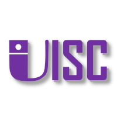

<a id="readme-top"></a>
<br />
<div align="center">
  <a href="https://github.com/Luxru/px4ctrl">
    
  </a>
  <h3 align="center">UISC Lab Px4Ctrl</h3>
  <p align="center">ROS 2 PX4 control core with Zenoh transport</p>
  
</div>

## About
`px4ctrl` is the onboard ROS 2 control node used for PX4 offboard flight.

## Architecture
```text
+-----------------------+                 +-----------------------+
|   Flight Controller   |                 | External MoCap / VIO  |
|     (PX4 Firmware)    |                 |   (Pose / Odometry)   |
+-----------+-----------+                 +-----------+-----------+
            ^                                         |
            | MAVLink (UART/TCP)                      | (Network/Serial)
            v                                         v
+-----------+-----------------------------------------+-------------+
|               Onboard Computer (ROS 2 Environment)                |
|                                                                   |
|   +--------------+         ROS 2         +-------------------+    |
|   | mavlink_node | <===================> |      px4ctrl      | <==+ Odom
|   +--------------+         (Ctrl)        +---------+---------+    |
|                                                    ^              |
|                                              ROS 2 |              |
|   +--------------------+                           |              |
|   | custom_controllers | <=========================+              |
|   +--------------------+                                          |
|                                                                   |
|   .............................................................   |
|                                                                   |
|                           Zenoh (DDS)                             |
|                               |                                   |
|                               v                                   |
|                     +------------------+                          |
|                     |       Zenoh      |                          |
|                     +---------+--------+                          |
+-------------------------------+-----------------------------------+
                                ^
                                | Zenoh (Network/WiFi)
                                v
+-------------------------------+-----------------------------------+
|                        Laptop (Client)                            |
|                                                                   |
|                     +------------------+                          |
|                     |  px4ctrl_client  |                          |
|                     +------------------+                          |
+-------------------------------------------------------------------+
```

Control selection in FSM:
- `SE3` controller for nominal trajectory/hover/takeoff/landing.
- `SAFE_LANDING` controller when odom or safety conditions require fallback.
- `EXTERNAL_CMD` when command stream is fresh and phase allows cmd-ctrl.
- `PROOF_ALIVE` output when essential inputs are not ready.

## Repository Layout
- `src/fsm.cpp`: main runtime loop, context build, process orchestration.
- `src/fsm_guard.cpp`: guard evaluation, phase transitions, phase-entry handlers.
- `src/fsm_control.cpp`: setpoint/control command builders and control publishing.
- `src/fsm_client.cpp`: client command handling and telemetry payload fill.
- `src/fsm_internal.h`: shared FSM helper constants and utility functions.

## Prerequisites
- ROS 2 (same distro as your MAVROS setup)
- `mavros_msgs`, `geometry_msgs`, `sensor_msgs`, `nav_msgs`
- `px4ctrl_msgs`
- `Eigen3`
- `spdlog`
- `zenoh-c`
- C++20 compiler

## Build
Build in your ROS 2 workspace with `colcon`:

```bash
cd /home/lux/orinctrl_ws
colcon build --packages-select px4ctrl --cmake-args -DCMAKE_BUILD_TYPE=Release
```

## Run
Typical simulation launch:

```bash
ros2 launch px4ctrl sim.launch.py
```

Launch files:
- `launch/sim.launch.py`
- `launch/mocap.launch.py`

Important launch parameters:
- `px4ctrl_base_dir`
- `px4ctrl_cfg_name` (for example `gz500.json`)
- `px4ctrl_transport_cfg_name` (for example `transport.json`)

## Configuration
Configuration files are in `config/`:
- Flight/control params: `gz500.json`, `xi35.json`
- Transport params: `transport.json`

Key guard fields in flight config:
- `use_rc`, `rc_timeout`, `rc_triggered`
- `enable_geofence`, `geofence_min`, `geofence_max`, `geofence_triggered`
- `enable_attitude_fence`, `max_roll_deg`, `max_pitch_deg`, `max_yaw_deg`, `attitude_triggered`
- `enable_velocity_fence`, `max_velocity_norm`, `velocity_triggered`

Angle limit rule:
- `-1` means unlimited.
- Otherwise valid range is `(0, 180]` degrees.

## RC Gating Behavior (`use_rc`)
When `guard.use_rc = true`:
- Startup is blocked until valid `mavros_msgs/RCIn` is present.
- RC loss during flight triggers guard action (`rc_triggered`).
- Client ARM/DISARM/OFFBOARD commands are rejected.
- PX4 mode switching and arming are expected to be done from RC side.

## Telemetry
Server payload includes:
- Vehicle state (`pos/vel/quat/omega`).
- Mission phase, offboard/armed status.
- Command setpoint feedback (`thrust_setpoint`, `omega_setpoint`).
- Guard/health fields (`guard_flags`, `odom_age_ms`, `client_cmd_age_ms`, `speed_norm`).
- Safety fields (`geofence_*`, `max_roll_deg/max_pitch_deg/max_yaw_deg`, feature enable flags, `use_rc`).

## Contact
Xu Lu - lux@cqu.edu.cn

## Acknowledgments
- [ZJU FastLab](https://github.com/ZJU-FAST-Lab)
- [UZH Robotics and Perception Group](https://github.com/uzh-rpg)
